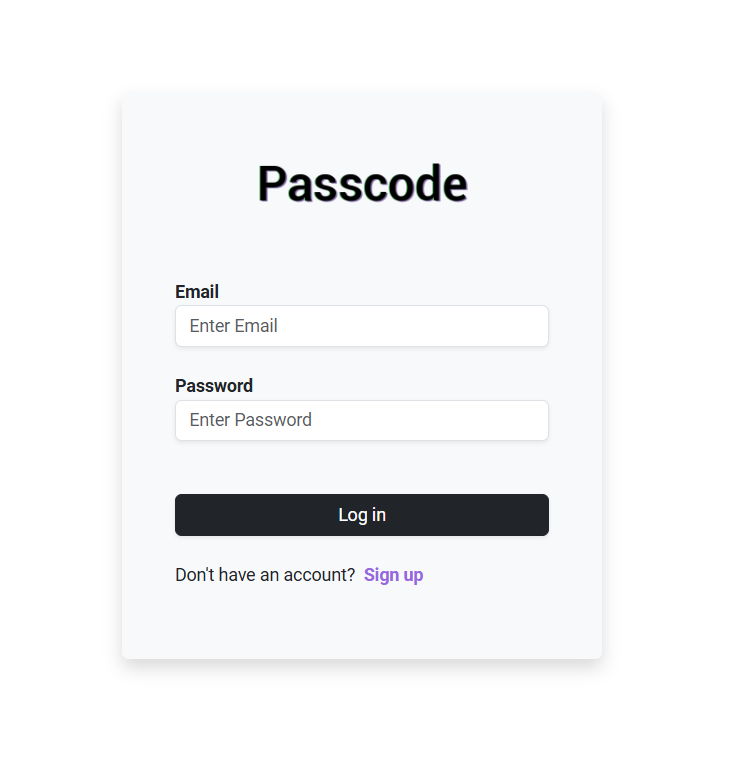
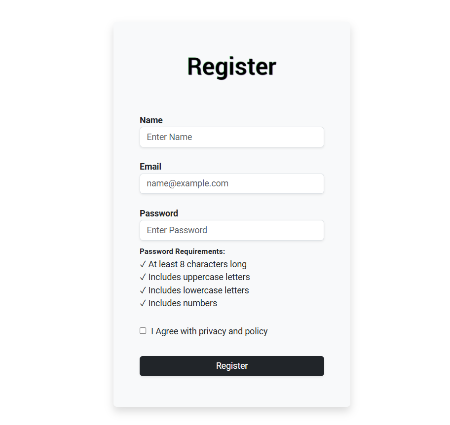

## 📄 Sobre o projeto

Este é um projeto de aplicação web focado em funcionalidades de login e registro de usuários, desenvolvido como uma solução completa de software. O projeto integra diversas tecnologias para oferecer uma experiência de usuário fluida e segura:

- Front-end: Utiliza React para criar uma interface interativa e responsiva, acompanhada de Bootstrap para um design moderno e acessível.  
- Back-end: Implementado com Node.js, fornecendo a lógica de aplicação e processamento de dados, incluindo autenticação e gerenciamento de sessões. 
- Banco de Dados: MySQL é usado para armazenar dados de usuários, garantindo integridade e eficiência no gerenciamento das informações. 

O projeto é projetado para ser um exemplo prático e funcional de como construir uma aplicação web completa, cobrindo desde a interface do usuário até a lógica de servidor e o gerenciamento de banco de dados. 

 

<table>
  <tr>
    <td></td>
    <td></td>
  </tr>
</table>

## 💻 Pré-requisitos

Antes de começar, verifique se você atendeu aos seguintes requisitos:

<!---Estes são apenas requisitos de exemplo. Adicionar, duplicar ou remover conforme necessário--->

- Você instalou a versão mais recente de `<Node/ v14 lts>` e `<React / v18.3.1+>`

 
