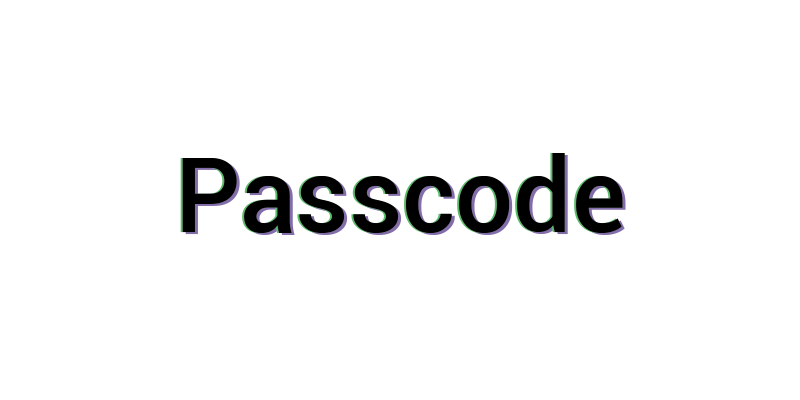

## 📄 Sobre o projeto

> Mini web projeto de login e registro de usuários, aplicando técnicas de front-end (React, bootstrap), back-end (NodeJs) e MySQL.

 

## 💻 Pré-requisitos

Antes de começar, verifique se você atendeu aos seguintes requisitos:

<!---Estes são apenas requisitos de exemplo. Adicionar, duplicar ou remover conforme necessário--->

- Você instalou a versão mais recente de `<Node/ v14 lts>` e `<React / v18.3.1+>`

 
